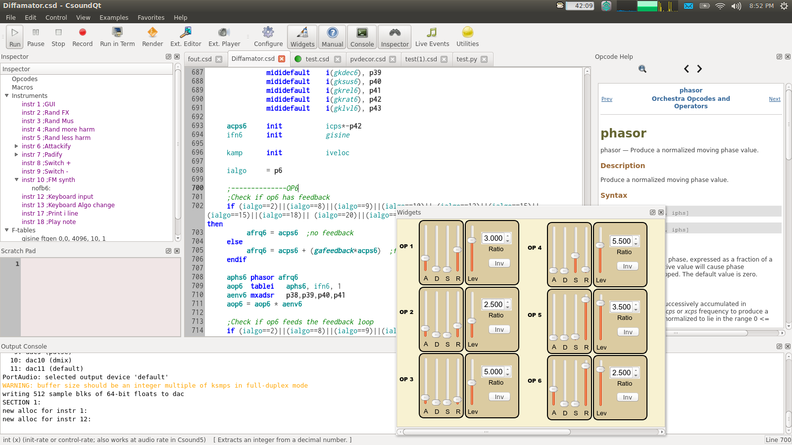

CsoundQt is a frontend for [Csound](http://csound.github.io/) featuring a
highlighting editor with autocomplete, interactive widgets and integrated
help. It is a cross-platform and aims to be a simple yet powerful and complete
development environment for Csound. It can open files created by
[MacCsound](http://www.csounds.com/matt/MacCsound/).

Csound is a musical programming language with a very long history, with roots
in the origins of computer music. It is still being maintained by an active
community and despite its age, is still one of the most powerful tools for
sound processing and synthesis. CsoundQt hopes to bring the power of Csound
to a larger group of people, by reducing Csound's initial learning curve, and
by giving users more immediate control of their sound. It hopes to be both a
simple tool for the beginner, as well as a powerful tool for experienced
users.

CsoundQt was awarded joint first prize in the
[Lomus 2010](http://www.afim-asso.org/spip.php?article19) Free Software
Competition.

## License

CsoundQt was written by Andrés Cabrera and others. CsoundQt is licensed under
the GPLv3 or at your option LGPLv2. This means you may use CsoundQt or any
portion of it for any purpose, but all derivative software must also be placed
under this license.

Please consider donating time or money to CsoundQt if you consider it useful.
Thanks! You can support the project at
[SourceForge](http://sourceforge.net/projects/qutecsound/).
