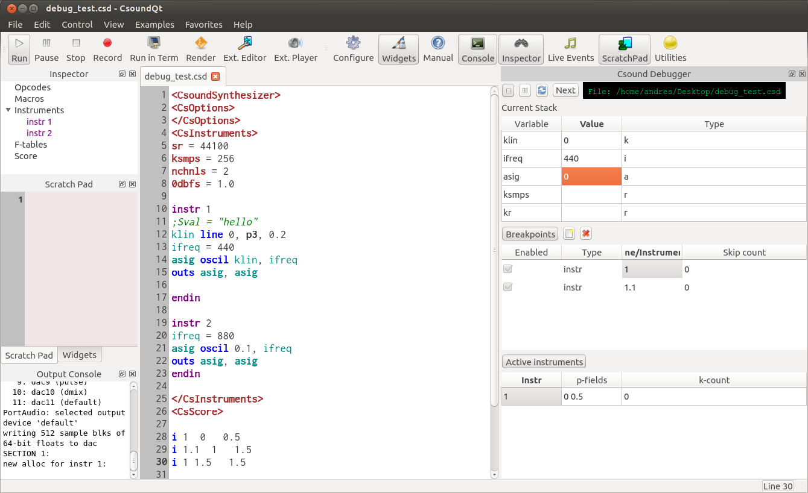

The debugger is now much closer to being function, with skip functionality, printing of current variable values, and showing the current active instrument list.

Testing is welcome, but you will need to build both Csound and CsoundQt from source (using `-DBUILD_DEBUGGER=1` for cmake on Csound and `CONFIG+=debugger` for qmake on CsoundQt)

