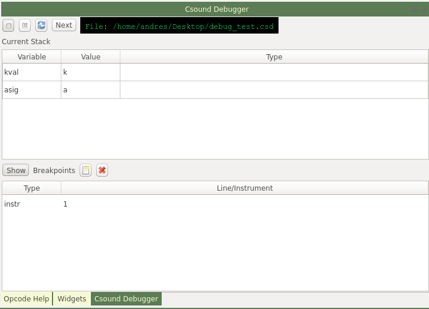

With some new experimental additions to Csound, I have added the initial proof of concept of what will hopefully become a powerful debugger for the Csound language. Like with regular debuggers, you will be able to set breakpoints (both for line number and instrument instances) and pause running of the Csound engine. When the debugger is paused, you will be able to see the current rendering chain, as well as exploring the variables, and eventually change values before continuing.

