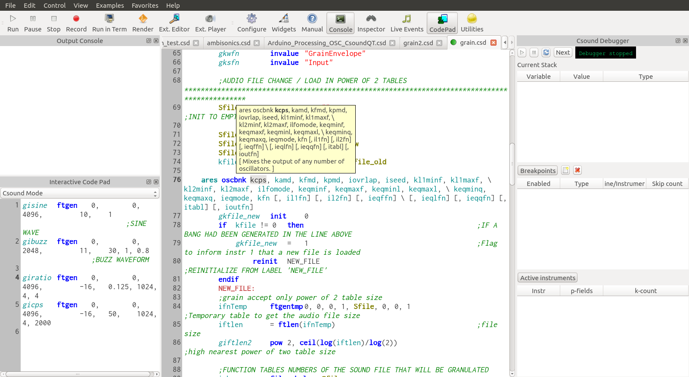

I'm happy to announce the release of version 0.8.3. This release includes many fixes and changes, in particular the addition of the debugger front-end as default now that Csound 6.03 has been released which includes debugging capabilites.

Other changes include:

- Added hover window in parameter mode showing opcode and parameter details
- Removed status bar as it no longer plays an important role
- Fixed graph displays
- ScratchPad renamed to Codepad and added a selector to specify whether to evaluate code as Csound code or Python code.
- Better auto-completion, parameter mode and tab behavior

You can get the source and pre-built binaries for OS X in the [SourceForge 0.8.3 files page](https://sourceforge.net/projects/qutecsound/files/CsoundQt/0.8.3/).
