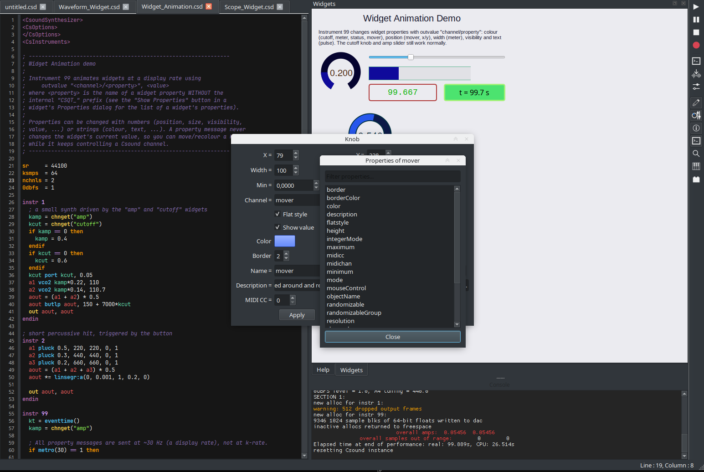

Widgets are not only a way for Csound to receive input — they can also be
**driven and animated from the orchestra**. Any widget property can be changed
at runtime with a *property message*:

```csound
outvalue "<channel>/<property>", <value>
```

A property message never changes a widget's *value*, so you can move, resize,
recolour or relabel a widget while it keeps controlling its Csound channel.

<video controls preload="metadata" style="width:100%; max-width:960px;">
  <source src="/videos/csoundqt-animation2.mp4" type="video/mp4">
  Your browser does not support the video tag.
</video>

## How it works

Send messages at a display rate (for example from a `metro(30)` block, as in
the example) rather than every k-cycle. Both numbers and strings are supported:

```csound
; colour: a hex string
Scol = sprintfk("#%02x%02x%02x", 127+120*sin(kt*0.8), 90, 200)
outvalue "cutoff/color", Scol

; position: integers
outvalue "mover/x", int(kx)
outvalue "mover/y", int(ky)

; size, visibility, text ...
outvalue "meter/width", 240
outvalue "pulse/visible", (int(kt*1.5) % 2)
outvalue "pulse/text", sprintfk("t = %4.1f s", kt)
```

The channel name is the widget's channel (the one it already uses to talk to
Csound)

## Discovering the properties

Every widget's Properties dialog has a **Show Properties** button which lists
all the properties that can be addressed, with a filter box for long lists:



## Example

The example **`C Widgets/Widget_Animation.csd`** animates colours, position,
width, visibility and text from instrument 99, on top of a small synth whose
`amp` slider and `cutoff` knob still work normally. Open it from the
**Examples → CsoundQt → C Widgets** menu.

See the source:
<https://github.com/CsoundQt/CsoundQt/blob/csoundqt7/src/Examples/CsoundQt/C%20Widgets/Widget_Animation.csd>

## Getting CsoundQt 7.2

Download the latest binaries from the
[releases page](https://github.com/CsoundQt/CsoundQt/releases/tag/v7.2.0)
(AppImage, Flatpak, macOS `.dmg` and the Windows installer). The complete
changelog is in the
[v7.2.0 release notes](https://github.com/CsoundQt/CsoundQt/blob/csoundqt7/release_notes/Release%20notes%20v7.2.0.md).
