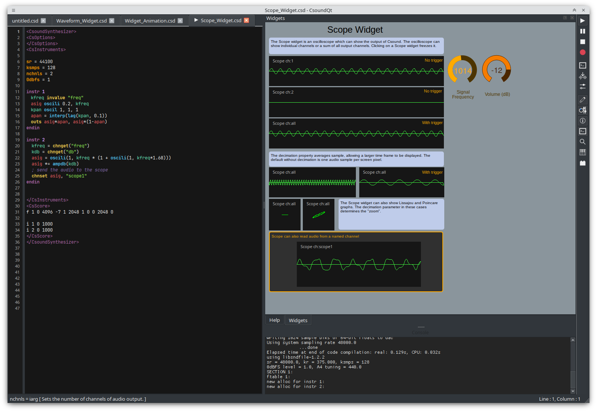

**CsoundQt 7.2** brings a set of long-requested widget features: a brand new
**waveform widget**, a **scope** that can display any Csound audio signal, and
**flat, fully themeable buttons**. (Animating widgets from Csound with
`outvalue` will be the subject of a separate post.)

## Waveform widget

The new **waveform widget** draws the samples of a Csound f-table directly in
the widget panel, so you can see exactly what a table (or a soundfile loaded
into one) looks like while you work, zoom, pan, set a playback cursor, etc.

<video controls preload="metadata" style="width:100%; max-width:960px;">
  <source src="/videos/csoundqt-waveform2.mp4" type="video/mp4">
  Your browser does not support the video tag.
</video>

- The f-table number is sent to the widget's channel; a second, string channel
  carries the cursor position (readable *and* writable from the orchestra).
- Multichannel tables are drawn as one lane per channel, sharing a common time
  axis.
- The mouse wheel zooms, Shift+wheel scrolls, and Ctrl+drag pans. The view
  follows the cursor when it moves out of sight.
- The table is copied before the Csound instance is destroyed, so the waveform
  stays visible after the performance stops.
- Try it with the updated example **`C Widgets/Waveform_Widget.csd`**.

## Scope: monitor any audio channel

Until now a scope could only show what Csound sends to its audio outputs. The
scope now has a second channel that names a Csound **audio channel**, making it
easy to probe any signal, even if this signal is not sent to csound's outputs

```csound
instr 1
  asig oscils 0.8, 220, 0
  chnset asig, "scopechan"   ; publish the signal on an audio channel
endin
```

Set the scope's **Audio Channel** to `scopechan` and it will display that
signal. All the usual scope options — zoom, trigger and display type — apply to
monitored channels as well.



## Flat buttons

Buttons can now opt into a **flat style** that is drawn by CsoundQt itself
instead of the native platform widget. The result looks identical on every
platform and is fully configurable: background colour, pressed background,
text and pressed-text colours, border colour, border width and corner radius.
Pushed colours default to the normal colours when left unset.

Enable **Flat** in a button's properties to try it — the updated
**`C Widgets/Button_Widget.csd`** example now includes flat and flat-latched
buttons.

## Getting CsoundQt 7.2

Download the latest binaries from the
[releases page](https://github.com/CsoundQt/CsoundQt/releases/tag/v7.2.0)
(AppImage, Flatpak, macOS `.dmg` and the Windows installer). The complete
changelog is in the
[v7.2.0 release notes](https://github.com/CsoundQt/CsoundQt/blob/csoundqt7/release_notes/Release%20notes%20v7.2.0.md).
